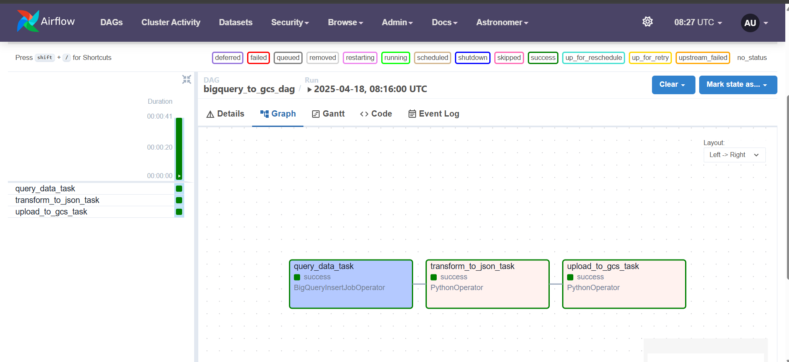
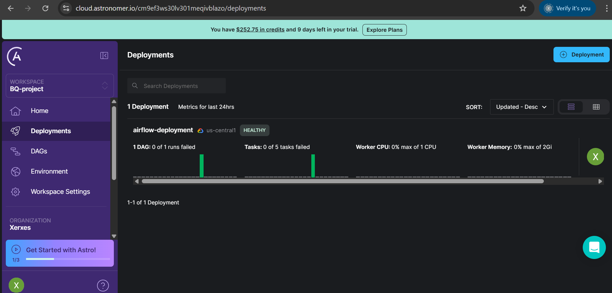
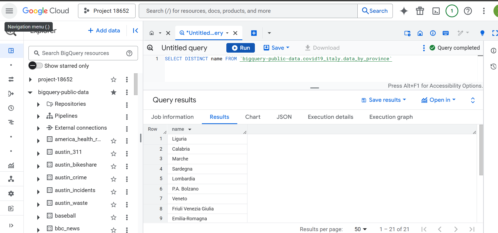
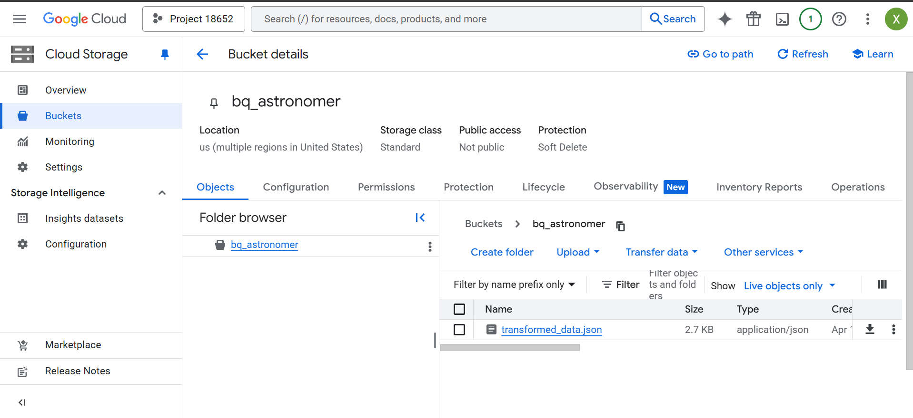
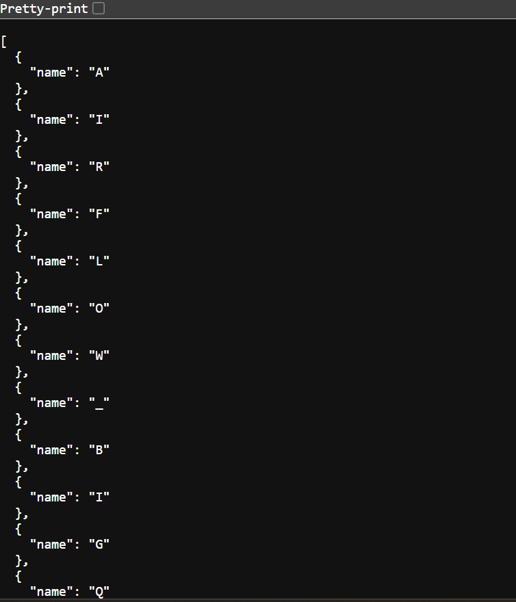

# Data Pipeline: BigQuery ➜ JSON ➜ GCS

This repository contains an end-to-end data pipeline orchestrated using **Apache Airflow**, deployed via **Astronomer**, designed to extract data from **Google BigQuery**, perform structured transformations, serialize the results into **JSON** format, and finally load the output into a designated **Google Cloud Storage (GCS)** bucket.

---

## 🛠️ Tech Stack

- **Apache Airflow (via Astronomer)**: DAG orchestration and scheduling.
- **Google BigQuery**: Cloud-native data warehouse used for querying structured data.
- **Python**: Custom transformation logic.
- **Google Cloud Storage (GCS)**: Target destination for the final JSON artifacts.
- **Astronomer Runtime**: Seamless development and deployment of Airflow DAGs.

---

## ⚙️ Pipeline Workflow

1. **Extraction**: Query execution against BigQuery tables using `BigQueryInsertJobOperator`.
2. **Transformation**: Post-query processing includes simple manipulation of the data using Python.
3. **Serialization**: Data is converted into JSON for optimized GCS compatibility.
4. **Loading**: The JSON files are uploaded to a GCS bucket using `GCSHook` with support for automatic file partitioning and versioning.

---

## 🖼️ Visuals

### DAG Overview

### Astronomer

### BigQuery Dataset

### GCS bucket

### Json file in GCS

---

